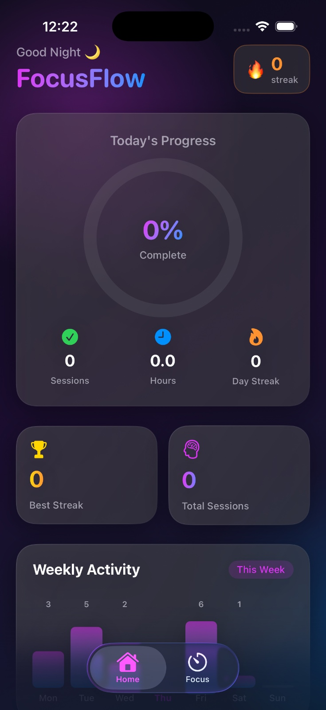
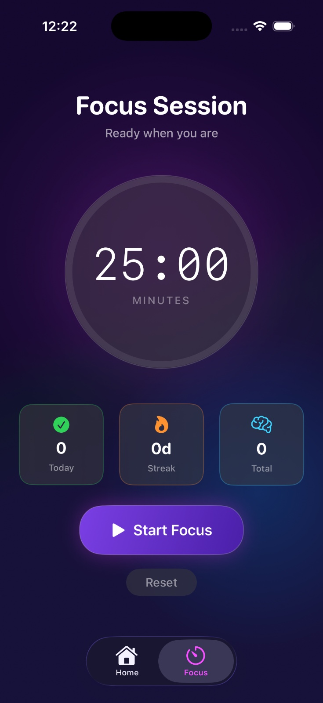
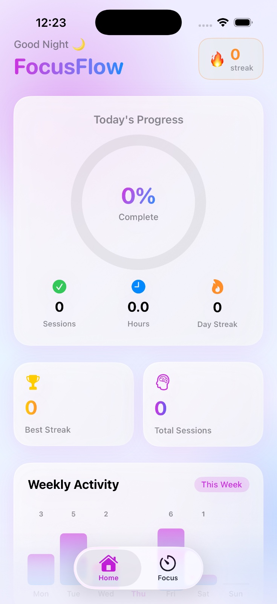

# FocusFlow – Smart Study Visualizer

<p align="center">
  
  
  
  
  
</p>

A visually premium, App Store–quality iOS productivity app for students and professionals. FocusFlow combines a Pomodoro-based focus timer, daily streak tracking, local notifications, and beautiful weekly analytics — all wrapped in a stunning glassmorphism UI that adapts to both Dark and Light modes.

---

## ✨ Features

### ⏱️ Focus Timer (Pomodoro)
- 25-minute Pomodoro timer with smooth countdown
- Start / Pause controls with spring animations
- Auto-reset after session completion
- Real-time circular progress arc with gradient stroke
- Completion banner with celebration feedback

### 🔥 Streak System
- Tracks daily completion streaks automatically
- Streak increases when at least one session is completed per day
- Streak resets if a day is missed (checked on every launch)
- Longest streak record persisted across app restarts
- Uses `UserDefaults` for lightweight, reliable persistence

### 🔔 Local Notifications
- Requests notification permission on first launch
- Schedules a daily reminder at 8:00 PM
- **Title:** "Don't break your streak 🔥"
- **Body:** "Complete at least one focus session today!"
- Automatically skips scheduling if permission is denied

### 📊 Weekly Analytics
- Pure SwiftUI bar chart — no external dependencies
- Visualises 7-day focus activity (Mon–Sun)
- Highlights today's bar with a purple glow
- Seeded with sample data on fresh installs; reflects real data once you start using it
- Animated bars on screen appearance

### 🎨 Premium Glassmorphism UI
- `.ultraThinMaterial` glass cards throughout
- Gradient mesh backgrounds with radial blob accents
- Angular gradient progress arcs with shadow glow
- Smooth spring animations on every interaction
- Monospaced timer font for a refined look
- All components support both Dark and Light mode

### 🌗 Dark / Light Mode
- Fully adaptive — follows system color scheme
- Distinct gradient palettes per mode
- Correct text contrast in all contexts

---

## 📸 Screenshots

| Home Dashboard (Dark) | Focus Timer (Dark) | Home Dashboard (Light) |
|:---:|:---:|:---:|
|  |  |  |

---

## 🏗️ Tech Stack

| Technology | Usage |
|---|---|
| **SwiftUI** | All UI components and navigation |
| **Combine** | Timer publisher (`Timer.publish`) |
| **UserDefaults** | Streak, session count, and weekly data persistence |
| **UserNotifications** | Permission request and daily reminder scheduling |
| **MVVM** | `TimerViewModel` as the timer's `ObservableObject` |

**No third-party libraries. No UIKit. Zero external dependencies.**

---

## 📂 Folder Structure

```
FocusFlow/
├── FocusFlow.xcodeproj/
│   ├── project.pbxproj
│   └── xcshareddata/xcschemes/FocusFlow.xcscheme
└── FocusFlow/
    ├── FocusFlowApp.swift          # @main entry point, injects env objects
    ├── MainTabView.swift           # TabView with Home & Focus tabs
    ├── ContentView.swift           # Home Dashboard screen
    ├── FocusView.swift             # Pomodoro timer screen
    ├── Color+Hex.swift             # Hex color initialiser extension
    ├── Assets.xcassets/            # App icon & accent colour
    ├── Components/
    │   ├── ProgressRing.swift      # Animated circular progress ring
    │   ├── GlassCard.swift         # Reusable glassmorphism card
    │   └── AnalyticsView.swift     # Weekly bar chart + bar column
    └── Managers/
        ├── TimerViewModel.swift    # ObservableObject: timer logic + persistence
        ├── StreakManager.swift      # ObservableObject: streak tracking + persistence
        └── NotificationManager.swift # Singleton: permission + scheduling
```

---

## 🚀 How to Run

### Prerequisites
- macOS 13 Ventura or later
- Xcode 15 or later
- iOS 16+ Simulator or physical device

### Steps

1. **Clone or unzip** the project:
   ```bash
   unzip FocusFlow.zip
   cd FocusFlow
   ```

2. **Open in Xcode:**
   ```bash
   open FocusFlow.xcodeproj
   ```

3. **Select your target** — choose an iPhone simulator (e.g. iPhone 15 Pro) or plug in a physical device.

4. **Build & Run** — press `⌘R` or click the ▶ Play button.

5. **Grant notification permission** when prompted on first launch.

> **Note:** Local notifications will only fire on a physical device or when the app is backgrounded. To test them, use a real iPhone.

---

## 🔮 Future Improvements

- [ ] **iCloud Sync** — sync streaks and session history across devices
- [ ] **Custom Timer Durations** — let users configure work/break intervals
- [ ] **Session Tags** — categorise sessions by subject (Math, Reading, etc.)
- [ ] **Sound & Haptics** — ambient sounds and completion haptic feedback
- [ ] **HealthKit Integration** — log mindful minutes automatically
- [ ] **Widget Extension** — home screen widget showing streak and next session
- [ ] **Focus Modes** — integrate with iOS Focus Mode to silence distractions
- [ ] **Onboarding Flow** — interactive first-launch walkthrough
- [ ] **Export / Share** — share weekly stats as an image card

---

## 👨‍💻 Project Purpose

Built as a portfolio-quality SwiftUI project demonstrating:
- Clean MVVM architecture
- Reactive state management with Combine
- Premium UI/UX design with animations
- System framework integration (Notifications, UserDefaults)

---

## 📄 License

This project is available under the **MIT License**. See `LICENSE` for details.
